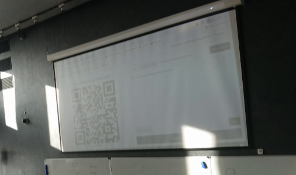
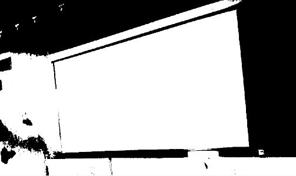
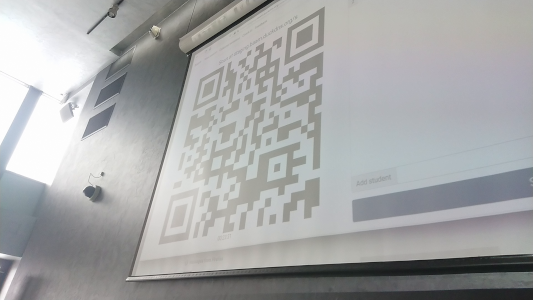

# pqrs

A Portable QR Scanning library.
Image processing is very much based on algorithms used in [BoofCV](https://boofcv.org).
Decoding and error correction is based on [zxing](https://github.com/zxing/zxing) 

Requires C++17 compiler. Seems to work with GCC and Clang

Compiles as native code and as webassembly code for browser usage using emscripten

### Demo

Demo is available [here](https://dcnick3.me/js/pqrs-test.html)

### Using in js projects

There is an [npm package](https://www.npmjs.com/package/pqrs-js)

It will work out-of-the box in nodejs and will probably require special handling for webassembly file distribution in browser.

You can see [pqrs-cli](https://github.com/DCNick3/pqrs-cli) for example usage.

## Long and sad story as to why this was created

I needed a QR scanning library in web application. 
So, I went with [jsQR](https://github.com/cozmo/jsQR), which is one of [zxing](https://github.com/zxing/zxing)  ports to js.
What could go wrong? Apparently, a lot.

The scanner was used to scan an image projected to screen in an intensively lit big lecture room.
Users were to scan it without leaving their places. And this actually posed a challenge...

I have distinguished two conditions that pose a challenge to zxing:

### 1. Low Contrast

First of them is low projector image contrast, which is an inherent problem of all projectors.
They cannot make "black" any darker than ambient lighting, so the only way to increase contrast is to make light regions even lighter, which is limited by physical abilities of the light source.

This affects the first stage of QR code scanning: detection & localization. Most scanners begin with image binarization and then try to detect finder patterns (the noticable three squares at the angles of the QR code).

Low contrast is quite a challenge for most binarization algorithms and, for no surprise, zxing struggled with it:

### 2. High perspective distortions

The second problem was due to the fact that lecture room was quite big and users were to scan QR without leaving their seats.
This required scanning from quite extreme angles and zxing does not handle huge perspective distortions caused by this quite well.

### The solution

With these cases in mind, I collected example images and used them to survey already existing QR scanners to find those reasonably handling my problematic cases.

That's when I found [BoofCV](https://boofcv.org/), which boasted [surprisingly good performance](https://boofcv.org/index.php?title=Performance:QrCode).
And apparently, it was actually worked pretty good in these conditions. 
There was only one problem: it's written in Java, which is not straightforward to run in browser context.

So, I've decided to write a C++ port(-ish) of BoofCV QR scanner and compile it to webassembly using emscripten.

From this I got, on one hand, an ability to use it in much more languages than BoofCV (C++, arguably, has interoperability rate comparable to that of C) and performance (wasm is quite close to what you can get in native code).

It is not a direct port, some corners were cut (where it seemed like it would not affect performance or scanning quality), some features were added (like local thresholding when sampling QR code modules, which handled the uneven lighting).

